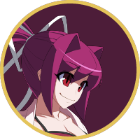
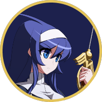
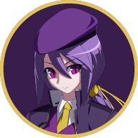

<h1 align="center">Tradução PT-BR — UNDER NIGHT IN-BIRTH II Sys:Celes</h1>

  Uma tradução feita por fãs, para jogar o UNI2 inteiro em português do Brasil. 
  Menus, tutorial, história, falas de vitória e imagens.

  <a href="#situação-da-tradução"><strong>Ver o progresso</strong></a> ·
  <a href="#como-ajudar"><strong>Quero ajudar</strong></a> ·
  <a href="#perguntas-rápidas"><strong>Dúvidas</strong></a>

---

## O que é este repositório

Aqui ficam **os arquivos de tradução**: as planilhas com as frases do jogo e as
imagens. É o material de trabalho da equipe.

---

## Situação da tradução

<!-- progresso:inicio -->

| Área | Situação | Detalhes |
| --- | --- | --- |
| Modo História | A fazer | [abrir](progresso/historia.md) |
| Frases de Vitória | A fazer | [abrir](progresso/vitoria.md) |
| Tutorial | A fazer | [abrir](progresso/tutorial.md) |
| Missões | A fazer | [abrir](progresso/missoes.md) |
| Menus e Sistema | Em andamento (81%) | [abrir](progresso/menus.md) |
| Imagens com texto | Em andamento (39%) | [abrir](progresso/imagens.md) |

_Atualizado em 2026-10-04._

<!-- progresso:fim -->

Clique em **abrir** para ver a lista completa de cada área, com o arquivo de
cada pedaço e as colunas de quem traduziu e quem revisou.

---

## Como ajudar

Se você foi chamado para traduzir, vai receber uma planilha com o pedaço que
ficou sob sua responsabilidade — não precisa procurar nada aqui dentro. Abra no
Excel ou no Google Sheets e trabalhe direto nela.

### As colunas

| Coluna | O que fazer |
| --- | --- |
| `key` | Não mexa — é o código interno que liga a frase ao jogo |
| `source_en` | O texto em inglês, para traduzir a partir dele |
| `source_slot` | O mesmo texto em italiano, para comparar o tamanho |
| `target` | **Sua tradução vai aqui** |
| `note` | Livre, para deixar recado para o revisor |

Deixar uma linha em branco mantém o texto original na tela, então dá para
traduzir aos poucos, sem precisar terminar a planilha inteira de uma vez.

### Os códigos dentro das frases

Algumas frases têm pedaços que **não são texto**: são instruções que o jogo lê
na hora de desenhar a tela. Eles precisam continuar ali, do mesmo jeito e na
mesma quantidade — mas podem mudar de lugar dentro da frase, se o português
pedir outra ordem.

| Código | O que significa |
| --- | --- |
| `<GR_NM_Yes>` | Chama outra frase da tabela. O jogo troca isso pelo texto certo na hora |
| `\@236+A@` | Um comando ou botão. O jogo desenha o desenho da setinha ou do botão no lugar |
| `\c40FFCD` | Começa a pintar o texto de uma cor (os seis caracteres são a cor) |
| `\cX` | Volta à cor normal. Todo `\c` colorido fecha com um destes |
| `\n` | Quebra de linha |
| `\k` | Pausa: o jogo espera o jogador apertar o botão para continuar |
| `%s` e `%d` | Buraco que o jogo preenche sozinho com uma palavra (`%s`) ou um número (`%d`) |

> **Exemplo.** `Aperte \@236+A@ para \c40FFCD defender\cX.\k`
> Traduzir é mexer só nas palavras: os três códigos continuam presentes, e o
> `\cX` continua fechando o `\c40FFCD`.

### Três cuidados

- **Use aspas retas `"` e hífen `-`** — travessão (`—`) e aspas curvas (`"` `"`)
  não existem na fonte do jogo e sairiam em branco na tela.
- **Olho no tamanho** — o português costuma ficar mais comprido que o inglês, e
  muitos espaços da tela são fixos. A coluna do italiano serve de régua do que
  cabe. Quando não couber, encurte: é melhor uma frase curta e certa do que uma
  frase cortada no meio.
- **Na dúvida, escreva na coluna `note`** — é melhor avisar o revisor do que
  chutar e deixar passar.

### Imagens

Quem pegar imagens recebe PNGs comuns. Troque as palavras e **salve no mesmo
tamanho em pixels** — o jogo recorta essas imagens em pedaços de medida fixa,
então mudar a altura ou a largura desalinha tudo na tela.

### Imagens que a ferramenta ainda não remonta sozinha

Alguns atlas guardam as páginas comprimidas dentro do `.pat`, e o leitor do
uni2loc só enxerga as páginas cruas. Os PNGs traduzidos destes arquivos estão
no repositório e o mod instalado já os usa, mas `uni2loc images build` passa
por eles sem reempacotar:

- `grpdat/Cockpit/gauge_ef01.pat` — painel de frames e cabeçalhos do dano
- `grpdat/CSel/csel00.pat` (página `single_00`) — topo da seleção de personagem
- `grpdat/Customize/customize00.pat`
- `grpdat/Gallery/gallery00.pat`
- `grpdat/Network/new/network00.pat`
- `grpdat/System/sys_combo00.pat` — rótulos de dano
- `grpdat/singleplay/sp_prof00.pat` — perfis do modo arcade

Enquanto isso não for resolvido, rodar `images build` por cima de um `build/`
pronto devolve essas páginas ao original. Reinstale a partir de um `build/`
completo, ou refaça essas páginas à mão.

---

## Perguntas rápidas

**Por que a tradução aparece no lugar do Italiano?**
O jogo guarda uma fonte diferente para cada grupo de idioma, e só a dos idiomas
latinos tem os acentos de que o português precisa. A tradução ocupa esse espaço,
e a entrada no menu passa a se chamar **PT-BR**.

**Isso quebra o jogo online?**
Não. Só muda textos e imagens no seu computador.

**Preciso saber programar?**
Não. Traduzir aqui é mexer em planilha e em imagem.

**E se der algo errado no jogo?**
A instalação é reversível e guarda os arquivos originais antes de trocar
qualquer coisa. Em último caso, a Steam tem *Verificar integridade dos arquivos
do jogo*, que devolve tudo ao normal.

---

## Créditos

<table>
  <tr>
    <td align="center" width="180">
       
      <strong>Yuko</strong> 
      Organizador e Tradutor
    </td>
    <td align="center" width="180">
       
      <strong>Willyofruit</strong> 
      Organizadora
    </td>
    <td align="center" width="180">
       
      <strong>Cultyhud</strong> 
      Tradutora
    </td>
  </tr>
</table>

---

  Projeto de fãs, sem fins lucrativos. 
  UNDER NIGHT IN-BIRTH II Sys:Celes é da French-Bread / Arc System Works / SEGA.

