# Rostinhos

Um avatar para cada personagem do jogo, para usar nos créditos do
[README](../README.md). Todos têm 200x200.

Para se creditar, copie o bloco de alguém que já está lá e troque o nome do
arquivo pelo do personagem que você quiser.

```html
<td align="center" width="180">
  <br>
  <strong>Seu nome</strong><br>
  <sub>Seu cargo</sub>
</td>
```

<table><tr>
  <td align="center" width="150">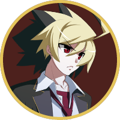<br><strong>Hyde</strong><br><sub><code>hyde.png</code></sub></td>
  <td align="center" width="150">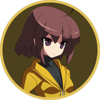<br><strong>Linne</strong><br><sub><code>linne.png</code></sub></td>
  <td align="center" width="150">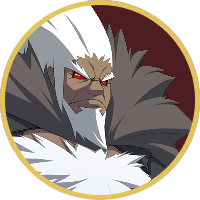<br><strong>Waldstein</strong><br><sub><code>waldstein.png</code></sub></td>
  <td align="center" width="150">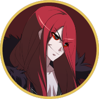<br><strong>Carmine</strong><br><sub><code>carmine.png</code></sub></td>
</tr></table>

<table><tr>
  <td align="center" width="150"><br><strong>Orie</strong><br><sub><code>orie.png</code></sub></td>
  <td align="center" width="150">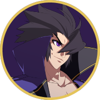<br><strong>Gordeau</strong><br><sub><code>gordeau.png</code></sub></td>
  <td align="center" width="150">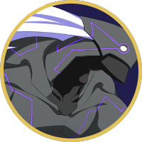<br><strong>Merkava</strong><br><sub><code>merkava.png</code></sub></td>
  <td align="center" width="150">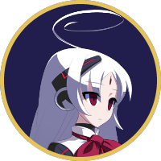<br><strong>Vatista</strong><br><sub><code>vatista.png</code></sub></td>
</tr></table>

<table><tr>
  <td align="center" width="150">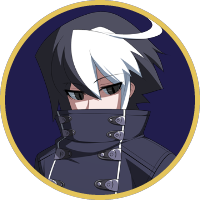<br><strong>Seth</strong><br><sub><code>seth.png</code></sub></td>
  <td align="center" width="150"><br><strong>Yuzuriha</strong><br><sub><code>yuzuriha.png</code></sub></td>
  <td align="center" width="150">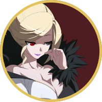<br><strong>Hilda</strong><br><sub><code>hilda.png</code></sub></td>
  <td align="center" width="150"><br><strong>Eltnum</strong><br><sub><code>eltnum.png</code></sub></td>
</tr></table>

<table><tr>
  <td align="center" width="150">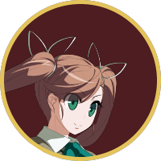<br><strong>Nanase</strong><br><sub><code>nanase.png</code></sub></td>
  <td align="center" width="150">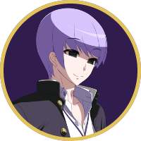<br><strong>Byakuya</strong><br><sub><code>byakuya.png</code></sub></td>
  <td align="center" width="150">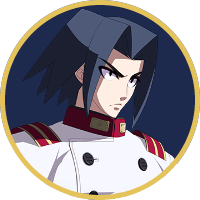<br><strong>Akatsuki</strong><br><sub><code>akatsuki.png</code></sub></td>
  <td align="center" width="150">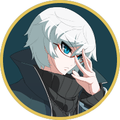<br><strong>Chaos</strong><br><sub><code>chaos.png</code></sub></td>
</tr></table>

<table><tr>
  <td align="center" width="150">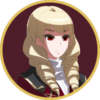<br><strong>Wagner</strong><br><sub><code>wagner.png</code></sub></td>
  <td align="center" width="150">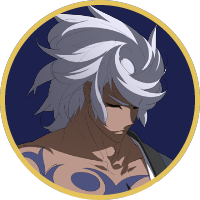<br><strong>Enkidu</strong><br><sub><code>enkidu.png</code></sub></td>
  <td align="center" width="150">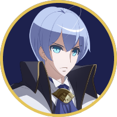<br><strong>Londrekia</strong><br><sub><code>londrekia.png</code></sub></td>
  <td align="center" width="150">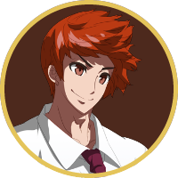<br><strong>Tsurugi</strong><br><sub><code>tsurugi.png</code></sub></td>
</tr></table>

<table><tr>
  <td align="center" width="150">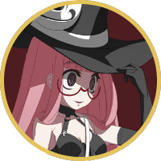<br><strong>Uzuki</strong><br><sub><code>uzuki.png</code></sub></td>
  <td align="center" width="150">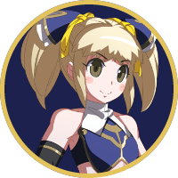<br><strong>Mika</strong><br><sub><code>mika.png</code></sub></td>
  <td align="center" width="150">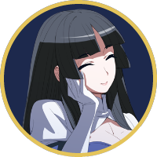<br><strong>Kaguya</strong><br><sub><code>kaguya.png</code></sub></td>
  <td align="center" width="150">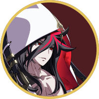<br><strong>Kuon</strong><br><sub><code>kuon.png</code></sub></td>
</tr></table>

<table><tr>
  <td align="center" width="150">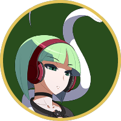<br><strong>Phonon</strong><br><sub><code>phonon.png</code></sub></td>
  <td align="center" width="150">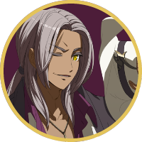<br><strong>Ogre</strong><br><sub><code>ogre.png</code></sub></td>
  <td align="center" width="150">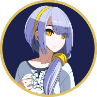<br><strong>Izumi</strong><br><sub><code>izumi.png</code></sub></td>
  <td align="center" width="150">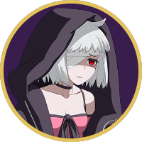<br><strong>Zohar</strong><br><sub><code>zohar.png</code></sub></td>
</tr></table>

